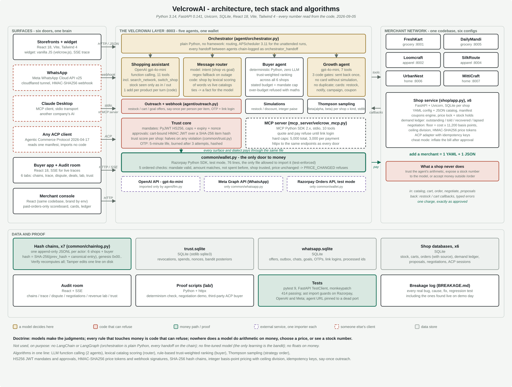

# VelcrowAI

A trust layer for agentic commerce. Merchants plug in and their shop becomes sellable to any AI agent; shoppers get one agent, on the web or in WhatsApp, that can buy anywhere in the network but can never be made to overpay.

## Brief

### The problem

Commerce is about to become agent-to-agent, and nobody is ready to trust it. Shoppers will not let an AI anywhere near their money. Merchants bleed revenue every day without noticing: a customer asks for six, the shelf has five, and the sale of the sixth quietly dies. A cart is abandoned and nobody follows up. Stock comes back and the person who wanted it is never told. None of it leaves a trace anyone can verify afterwards.

### The insight

Here is what we realised while brainstorming: **a single agent sitting in a single channel cannot grow commerce.** A chatbot on one website only helps the people who happen to come back to that website. Real buying happens everywhere - on the shop page, on WhatsApp, through other people's AI agents - and the moments where revenue is actually lost happen when the customer is *not* on your site at all.

So we flipped the design. Instead of one agent in one place, VelcrowAI puts **one brain behind every channel of interaction**:

- **On the shop page** - a widget you talk to in plain language; it searches, adds, claims coupons, and quotes.
- **On WhatsApp** - text the agent like a friend ("3 chanderi dupattas"), and it shops, quotes, and sends a tap-to-approve button. It even reaches out first: when your missing item is restocked, it completes your basket and messages you the exact total.
- **Across shops** - say "find me a cotton kurti under 1500" and it compares every store in the network: six merchants across grocery, apparel and home, every domain with a direct competitor. Options are ranked by price, fit and earned trust, anything over budget is refused with the arithmetic attached - and your 1500 becomes a hard cap the wallet itself enforces.
- **To other AIs** - a stranger's agent that has never seen these shops can discover them from one manifest file and buy through the industry's Agentic Commerce Protocol. And any MCP client - Claude Desktop included - can shop the whole network through the bundled MCP server: same shops, same quotes, same wallet.
- **For the merchant** - a growth agent wakes every hour, reads real sales and lost-demand numbers, simulates every idea, and either proposes a restock or a campaign with the numbers attached - or honestly says "nothing worth doing."

Same agent, every door. That is how an agent increases commerce instead of just answering questions.

### Why anyone can trust it

One architectural rule holds the whole thing together: **models make the judgments, but every rule that touches money or truth is code that can refuse.** A 76-line wallet with five ordered checks is the only door to money, for every channel. Payments need a signed mandate plus your approval of one exact amount - the agent literally has no tool that can pay. Negotiated prices are single-use signed tokens. WhatsApp taps are signature-verified. And every action of every actor lands on an append-only hash chain: tamper with one entry and the audit page turns red at that exact index.

The proof it is an agent and not a script ships with the repo: run `lab/determinism_check.py` and the same sentence produces visibly different tool traces when the world differs - the script fails itself if they ever match.

### Honest by construction

Razorpay runs in test mode and WhatsApp on Meta's test tier - real APIs, no real rupees, no strangers reachable. 414 tests pass. And every real bug we hit building this, including the ones found live by a real shopper mid-demo, is written up in `BREAKAGE.md` with the fix and a regression test - because an audit trail you can attack, and a failure log we kept, are worth more than a demo that pretends nothing ever broke. The stories worth telling are in [docs/WHAT_BROKE.md](docs/WHAT_BROKE.md); the video script is in [docs/VIDEO_SCRIPT.md](docs/VIDEO_SCRIPT.md), and the scene-by-scene presenter notes, with the technology behind each scene, in [docs/PRESENTER_SCRIPT.md](docs/PRESENTER_SCRIPT.md).

## Architecture

<p align="center"></p>

Models think in tier 3, arithmetic lives in tier 4, money passes only through the wallet, and every actor's every action lands on a hash chain in tier 5.

### Tech stack and algorithms, on one page

<p align="center"></p>

Gold is where a model decides, red is code that can refuse, green is the money path and the proof, dashed purple is an external service with exactly one importing module. Every figure on it was read from the code: 11 assistant tools, 7 growth-agent tools, 10 MCP tools, a 76-line wallet, 7 hash chains, 414 tests.

| Part | Technique | Built with |
|---|---|---|
| Shopping assistant | LLM function calling; stock seen only as in/out; one add per product per turn enforced in code | OpenAI gpt-4o-mini, asyncio, httpx |
| Message router | model judges intent (instruction vs goal) with a regex fallback; deterministic code picks the shop by scoring words against live catalogs | gpt-4o-mini, plain Python |
| Buyer agent | rules and trust-weighted ranking across six shops; the stated budget becomes the mandate cap; zero model calls | Python, SQLite |
| Growth agent | LLM tool loop behind three code gates: sent back once, no card without a simulation, no duplicates | gpt-4o-mini, APScheduler |
| Strategy order | Thompson sampling, one Beta(alpha, beta) per shop and card kind | stdlib random |
| Negotiation | floor = cost in integer basis points with ceiling division; offers are signed price tokens, spendable once | HMAC-SHA256 |
| Mandates and approvals | signed session mandates with caps, expiry and nonce; cart-bound approvals over a hash of the items | PyJWT HS256, SHA-256 |
| Wallet | five ordered checks, exact-amount capture, PRICE_CHANGED refusal | Razorpay Python SDK, test mode |
| Trust | per-shop score that halves on any violation; ranks the buyer's choices | Python, SQLite |
| WhatsApp | signed webhooks, replay dedupe, say-once offers, hashed OTPs that expire in five minutes and burn after three attempts, link login | Meta Cloud API v25, hmac, hashlib, secrets |
| Other agents | Agentic Commerce Protocol 2026-04-17 with idempotency keys; MCP server with a login gate and hard spend caps | httpx, MCP Python SDK 2.x |
| Proof | SHA-256 hash chain per actor, append-only; a determinism check that fails itself if two worlds give the same trace | hashlib, pytest |

Not used, on purpose: no LangChain or LangGraph (orchestration is plain Python and every handoff is chain-logged), no fine-tuned model (the only learning is the bandit), no floats anywhere near money.

## Agent-to-agent flow

<p align="center"></p>

The two shops never talk to each other. Buying side and selling side meet only at published endpoints, and money only at the wallet.

## User flow

<p align="center"></p>

The shopper never creates an account, never types a password or card number, and never has to trust anyone: every charge is an exact amount they saw and tapped, checked by code.

## Branches of the project

<p align="center"></p>

## Repository layout

```
velcrow-ai/
  run_all.ps1            start or stop all ten services
  reset_demo.ps1         wipe orders, carts, chains and trust back to a clean shop
  requirements.txt       Python dependencies (FastAPI, httpx, PyJWT, razorpay, openai, mcp, APScheduler)
  BREAKAGE.md            every real bug, in order: cause, fix, regression test
  VELCROW_ROUND2_1.md    the build spec this codebase implements

  common/                shared by every service; nothing here imports a model
    wallet.py              the only door to money: five checks, the only Razorpay importer
    mandate.py             session mandates (HS256 JWT with caps, expiry, nonce)
    approval.py            cart-bound approvals over a SHA-256 hash of the items
    chainlog.py            SHA-256 hash chains, one append-only JSONL per actor
    trust.py               per-shop trust score, halves on any violation
    bandit.py              Thompson sampling over the growth agent's card kinds
    money.py               the one money formatter (integer paise in, rupee strings out)
    contact.py             one normalisation for the shopper key (phone or email)
    errors.py              typed error taxonomy with machine codes
    whatsapp.py            the only module that talks to Meta's Graph API

  agent/                 the VelcrowAI layer, port 8003
    app.py                 FastAPI service: widget, webhook, buyer, merchant, audit, callbacks
    orchestrator.py        which agent gets the work; schedules; chain-logged handoffs
    runtime.py             the tool-calling loop and the run registry behind SSE
    tools.py               the assistant's 11 tools; zero LLM imports
    llm.py                 the only module that imports the OpenAI SDK; prompts, schemas, fallbacks
    outreach.py            WhatsApp: chat turns, offers, taps, OTP and link login, say-once
    buyer.py               the deterministic cross-shop buyer agent
    merchant.py            the growth agent: seven tools, three gates, simulations
    static/velcrow.js      the storefront widget

  shop/                  one shop codebase, six configs, ports 8001 to 8007
    app.py                 catalog, cart, order, restock, proposals, ledger, console API
    db.py                  SQLite: stock, carts, orders, demand ledger, proposals, sessions
    coupons.py             coupon optimiser
    negotiation.py         agent-to-agent price negotiation with signed tokens
    acp.py                 Agentic Commerce Protocol adapter
    config.py              loads a YAML config and its JSON catalog
    configs/               grocery, grocery2, apparel, apparel2, home, home2
    catalogs/              the matching product files

  mcp_server/
    velcrow_mcp.py         VelcrowAI as an MCP server: ten tools, login gate, hard caps

  web-shop/              storefront, checkout, orders, merchant console (React, Vite, Tailwind)
  web-agent/             buyer app and audit room (React, SSE)

  lab/                   scripts that drive the running system
    determinism_check.py   the not-a-script proof
    negotiate_demo.py      three negotiations end to end
    third_party_buyer.py   a stranger's ACP buyer that imports none of this code
    revenue_lab.py         what the agent actually did to a merchant's books
    seed_demo.py           seed a paired demo the lab can measure
    buy.py, convo.py, issue_mandate.py, regress.py   harnesses and a conversation regression suite

  tests/                 414 tests: import guards, wallet, mandates, chains, shops, ACP,
                         MCP, WhatsApp, orchestrator, growth agent, ledger settlement

  docs/                  diagrams (SVG), WHAT_BROKE.md, VIDEO_SCRIPT.md, PRESENTER_SCRIPT.md
  data/                  runtime state, git-ignored: SQLite databases and chain logs
```

## Run it

```
.\run_all.ps1          # ten services, one command
.\run_all.ps1 -Stop    # stop everything
```

The network: FreshKart and DailyMandi (grocery, :8001/:8005), Loomcraft and SilkRoute (apparel, :8002/:8004), UrbanNest and MittiCraft (home, :8006/:8007) - every domain a two-merchant contest.

To shop the network from Claude Desktop (or any MCP client), point it at the bundled MCP server - `mcp_server/velcrow_mcp.py`. It is a thin adapter over the same endpoints: quotes come from the shops, and the only tool that can move money is `pay_quote`, which demands the exact quoted amount and runs the same five-check wallet (a wrong amount is refused with `PRICE_CHANGED`). Claude Desktop config:

```json
{"mcpServers": {"velcrow": {
    "command": "<repo>\\.venv\\Scripts\\python.exe",
    "args": ["<repo>\\mcp_server\\velcrow_mcp.py"],
    "env": {"PYTHONPATH": "<repo>"}}}}
```

The absolute script path and `PYTHONPATH` matter: the Microsoft Store build of Claude Desktop ignores `cwd`. After changing the config, quit Claude Desktop from the tray and reopen it.

Storefronts at http://localhost:5173 and :5174, buyer app and audit at :5175, merchant consoles at /console on each storefront. The four newer merchants have no storefront by design - they joined the network API-first, which is the point: an agent can shop them anyway. Razorpay is test mode; WhatsApp is Meta's test number tier. No real money moves anywhere in this project.
