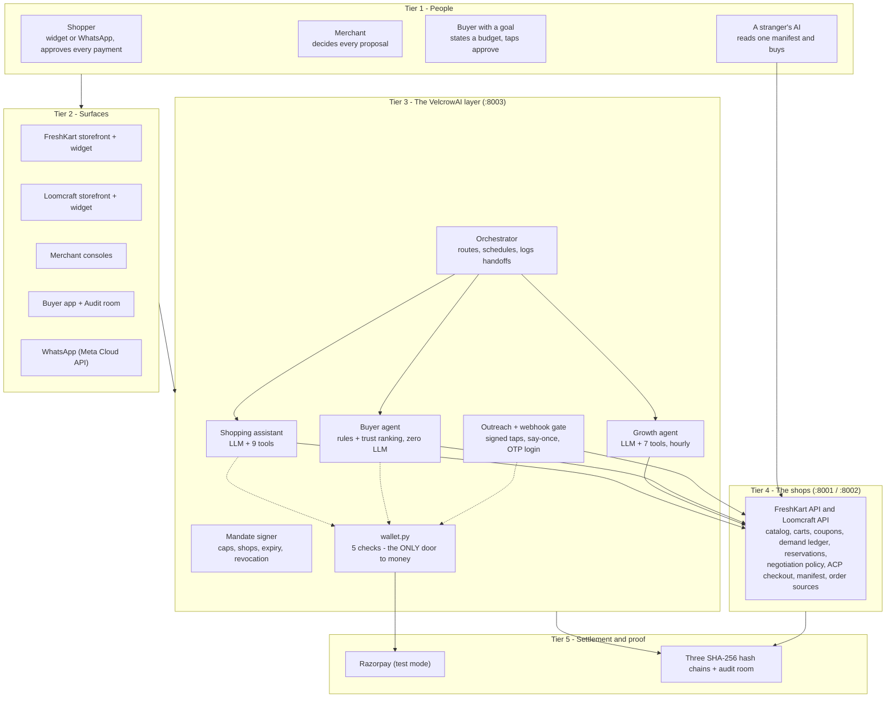
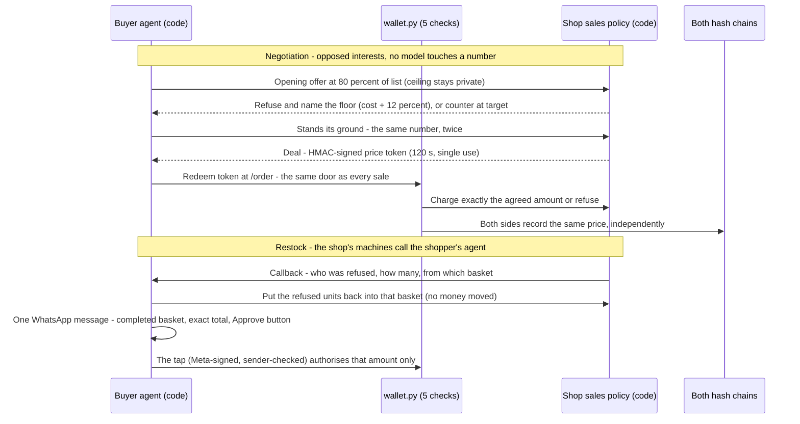
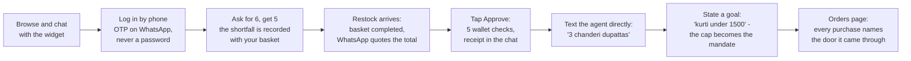

# VelcrowAI

A trust layer for agentic commerce. Merchants plug in and their shop becomes sellable to any AI agent; shoppers get one agent, on the web or in WhatsApp, that can buy anywhere in the network but can never be made to overpay.

## Brief

Commerce is about to be agent-to-agent, and neither side is ready to trust it. Shoppers will not let an AI near their money; merchants lose refusals, abandoned carts, and restock moments silently, with no way to prove what happened afterwards. VelcrowAI answers both with one architectural rule: judgment comes from models, but every rule that touches money or truth is deterministic code that can refuse.

Three LLM agents make the decisions. A shopping assistant (nine tools) serves the shopper on the storefront widget and over WhatsApp; a growth agent (seven tools) wakes hourly per shop, reads real sales and lost-demand numbers, simulates every idea, and files proposal cards or honestly concludes "no action"; a message router judges whether each WhatsApp text is an instruction inside one shop or a goal to satisfy across all of them. Around them stands the machinery no model can talk its way past: HMAC-signed session mandates and cart-bound approvals, a 76-line wallet with five ordered checks as the only door to money, signed single-use negotiation tokens, signature-verified webhooks, and append-only SHA-256 hash chains that make every action of every actor tamper-evident and auditable from both sides.

The result runs end to end today: a shopper is refused for stock, the shortfall is valued in a four-state demand ledger, a restock completes their basket and one WhatsApp message quotes the exact total, a tap pays it through the same wallet as every other sale, and the order appears in their history naming the door it came through. A stranger's client can buy through the published Agentic Commerce Protocol; two agents with opposed interests negotiate signed deals; a determinism check fails the build if the agent ever behaves like a script. Payments are Razorpay test mode and messaging is Meta's test tier throughout - the same discipline: real APIs, no strangers reachable, no real rupees moved. 395 tests pass.

## Architecture



Models think in tier 3, arithmetic lives in tier 4, money passes only through the wallet, and every actor's every action lands on a hash chain in tier 5.

## Agent-to-agent flow



The two shops never talk to each other. Buying side and selling side meet only at published endpoints, and money only at the wallet.

## User flow



The shopper never creates an account, never types a password or card number, and never has to trust anyone: every charge is an exact amount they saw and tapped, checked by code.

## Branches of the project

```mermaid
flowchart TB
  ROOT["VelcrowAI"]

  ROOT --> AG["Agents"]
  AG --> AG1["Shopping assistant - agent/runtime.py, agent/tools.py, agent/llm.py"]
  AG --> AG2["Growth agent - agent/merchant.py"]
  AG --> AG3["Buyer agent - agent/buyer.py"]
  AG --> AG4["Orchestrator - agent/orchestrator.py"]
  AG --> AG5["WhatsApp outreach - agent/outreach.py, common/whatsapp.py"]

  ROOT --> TR["Trust core"]
  TR --> TR1["Mandates and approvals - common/mandate.py, common/approval.py"]
  TR --> TR2["The wallet - common/wallet.py"]
  TR --> TR3["Hash chains - common/chainlog.py"]
  TR --> TR4["Trust scores - common/trust.py"]
  TR --> TR5["Bandit learning - common/bandit.py"]

  ROOT --> SP["Shops"]
  SP --> SP1["Shop API - shop/app.py, shop/db.py"]
  SP --> SP2["Coupon engine - shop/coupons.py"]
  SP --> SP3["Negotiation policy - shop/negotiation.py"]
  SP --> SP4["ACP checkout - shop/acp.py"]

  ROOT --> UI["Surfaces"]
  UI --> UI1["Storefronts and consoles - web-shop/"]
  UI --> UI2["Buyer app and audit room - web-agent/"]
  UI --> UI3["Embedded widget - agent/static/velcrow.js"]

  ROOT --> PR["Proof"]
  PR --> PR1["Determinism check - lab/determinism_check.py"]
  PR --> PR2["Revenue Lab - lab/revenue_lab.py"]
  PR --> PR3["Negotiation demo - lab/negotiate_demo.py"]
  PR --> PR4["Third-party ACP buyer - lab/third_party_buyer.py"]
  PR --> PR5["395 tests - tests/"]
  PR --> PR6["Honest failure log - BREAKAGE.md"]
```



## Run it

```
.\run_all.ps1          # six services, one command
.\run_all.ps1 -Stop    # stop everything
```

Storefronts at http://localhost:5173 and :5174, buyer app and audit at :5175, merchant consoles at /console on each storefront. Razorpay is test mode; WhatsApp is Meta's test number tier. No real money moves anywhere in this project.
