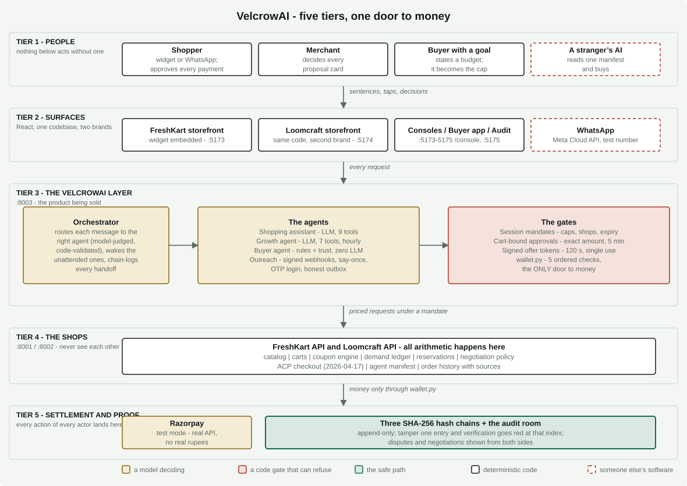
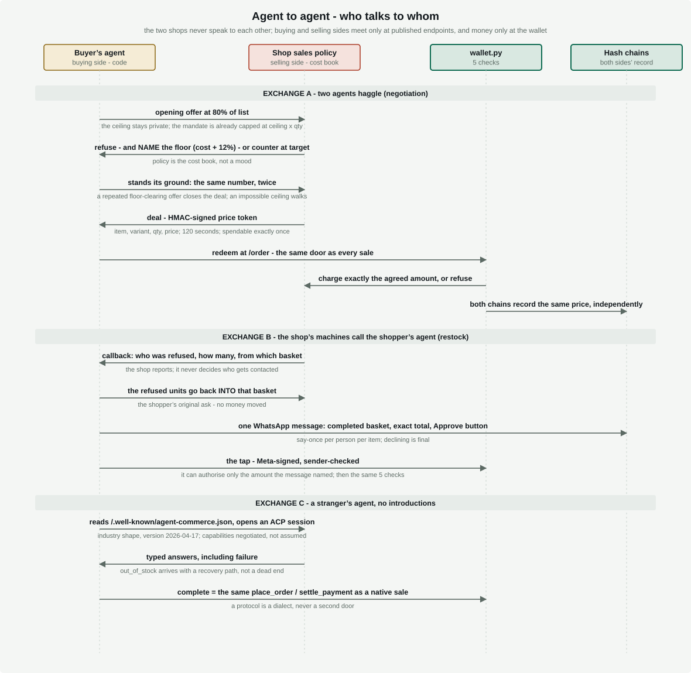
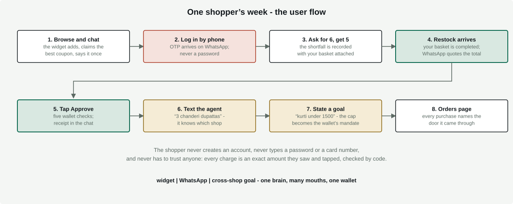
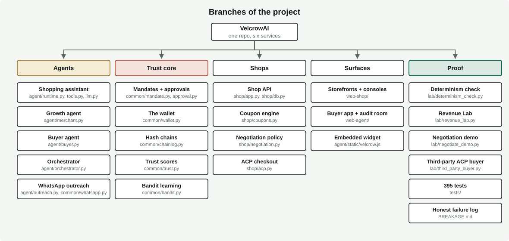

# VelcrowAI

A trust layer for agentic commerce. Merchants plug in and their shop becomes sellable to any AI agent; shoppers get one agent, on the web or in WhatsApp, that can buy anywhere in the network but can never be made to overpay.

## Brief

### The problem

Commerce is about to become agent-to-agent, and nobody is ready to trust it. Shoppers will not let an AI anywhere near their money. Merchants bleed revenue every day without noticing: a customer asks for six, the shelf has five, and the sale of the sixth quietly dies. A cart is abandoned and nobody follows up. Stock comes back and the person who wanted it is never told. None of it leaves a trace anyone can verify afterwards.

### The insight

Here is what we realised while brainstorming: **a single agent sitting in a single channel cannot grow commerce.** A chatbot on one website only helps the people who happen to come back to that website. Real buying happens everywhere - on the shop page, on WhatsApp, through other people's AI agents - and the moments where revenue is actually lost happen when the customer is *not* on your site at all.

So we flipped the design. Instead of one agent in one place, VelcrowAI puts **one brain behind every channel of interaction**:

- **On the shop page** - a widget you talk to in plain language; it searches, adds, claims coupons, and quotes.
- **On WhatsApp** - text the agent like a friend ("3 chanderi dupattas"), and it shops, quotes, and sends a tap-to-approve button. It even reaches out first: when your missing item is restocked, it completes your basket and messages you the exact total.
- **Across shops** - say "find me a cotton kurti under 1500" and it compares every store, ranks the options, and your 1500 becomes a hard cap the wallet itself enforces.
- **To other AIs** - a stranger's agent that has never seen these shops can discover them from one manifest file and buy through the industry's Agentic Commerce Protocol.
- **For the merchant** - a growth agent wakes every hour, reads real sales and lost-demand numbers, simulates every idea, and either proposes a restock or a campaign with the numbers attached - or honestly says "nothing worth doing."

Same agent, every door. That is how an agent increases commerce instead of just answering questions.

### Why anyone can trust it

One architectural rule holds the whole thing together: **models make the judgments, but every rule that touches money or truth is code that can refuse.** A 76-line wallet with five ordered checks is the only door to money, for every channel. Payments need a signed mandate plus your approval of one exact amount - the agent literally has no tool that can pay. Negotiated prices are single-use signed tokens. WhatsApp taps are signature-verified. And every action of every actor lands on an append-only hash chain: tamper with one entry and the audit page turns red at that exact index.

The proof it is an agent and not a script ships with the repo: run `lab/determinism_check.py` and the same sentence produces visibly different tool traces when the world differs - the script fails itself if they ever match.

### Honest by construction

Razorpay runs in test mode and WhatsApp on Meta's test tier - real APIs, no real rupees, no strangers reachable. 395 tests pass. And every real bug we hit building this, including the ones found live by a real shopper mid-demo, is written up in `BREAKAGE.md` with the fix and a regression test - because an audit trail you can attack, and a failure log we kept, are worth more than a demo that pretends nothing ever broke.

## Architecture

<p align="center"></p>

Models think in tier 3, arithmetic lives in tier 4, money passes only through the wallet, and every actor's every action lands on a hash chain in tier 5.

## Agent-to-agent flow

<p align="center"></p>

The two shops never talk to each other. Buying side and selling side meet only at published endpoints, and money only at the wallet.

## User flow

<p align="center"></p>

The shopper never creates an account, never types a password or card number, and never has to trust anyone: every charge is an exact amount they saw and tapped, checked by code.

## Branches of the project

<p align="center"></p>

## Run it

```
.\run_all.ps1          # six services, one command
.\run_all.ps1 -Stop    # stop everything
```

Storefronts at http://localhost:5173 and :5174, buyer app and audit at :5175, merchant consoles at /console on each storefront. Razorpay is test mode; WhatsApp is Meta's test number tier. No real money moves anywhere in this project.
